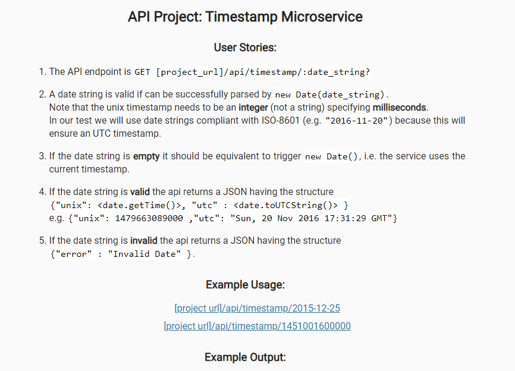

# API Project: Timestamp Microservice for FCC



### User stories:

1. The API endpoint is `GET [project_url]/api/timestamp/:date_string?`
2. A date string is valid if can be successfully parsed by `new Date(date_string)` (JS) . Note that the unix timestamp needs to be an **integer** (not a string) specifying **milliseconds**. In our test we will use date strings compliant with ISO-8601 (e.g. `"2016-11-20"`) because this will ensure an UTC timestamp.
3. If the date string is **empty** it should be equivalent to trigger `new Date()`, i.e. the service uses the current timestamp.
4. If the date string is **valid** the api returns a JSON having the structure 
`{"unix": <date.getTime()>, "utc" : <date.toUTCString()> }`
e.g. `{"unix": 1479663089000 ,"utc": "Sun, 20 Nov 2016 17:31:29 GMT"}`.
5. If the date string is **invalid** the api returns a JSON having the structure `{"error" : "Invalid Date" }`.

#### Example usage:
* https://Timestamp-Microservice--freecodecamp.repl.co/api/timestamp/2015-12-25
*https://Timestamp-Microservice--freecodecamp.repl.co/api/timestamp/1451001600000

#### Example output:
* {"unix":1451001600000, "utc":"Fri, 25 Dec 2015 00:00:00 GMT"}

#### Solution/Approach

- [x] Installed moment.js 

- [x] Created two routes
	
	* /api/timestamp/

	* /api/timestamp/:date_string

- [x] Handled ISO 8609 format with momemt.js

	```

	moment(date_string, "YYYY-MM-DDTHH:mm:ss", true).isValid() || moment(date_string, "YYYY-MM-DD", true).isValid()


	```

- [x] Used vanilla js functions

	```

	.getTime() //for timestamp

	.toUTCString() //for datetime in YYYY-MM-DDTHH:mm:ss format

	```

- [x] Ensured it accepts date, datetime and also unix timestamp as possible inputs

- [x] Used Regex to check for unix timestamp

	```

	/\d/.test(date_string)

	```

	
